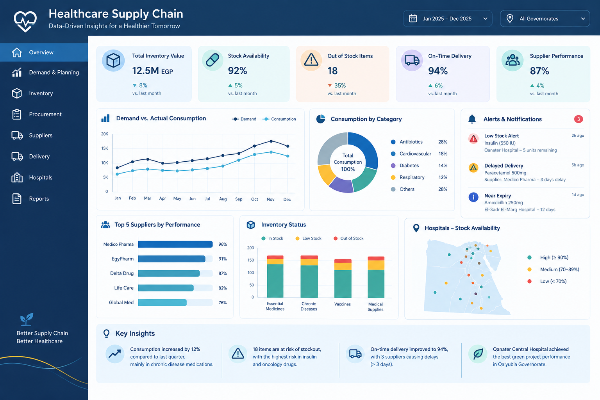

# Healthcare Supply Chain Analytics in Public Hospitals

  

# Healthcare Supply Chain Analytics in Public Hospitals

## Project Overview

This project analyzes healthcare supply chain performance in public hospitals to improve procurement efficiency, inventory management, supplier performance, and operational decision-making.

The project combines data simulation, web scraping, SQL analysis, and Power BI dashboards to provide actionable insights for healthcare organizations.

---

## Objectives

- Analyze procurement performance.
- Monitor inventory levels.
- Evaluate supplier performance.
- Identify stock-out risks.
- Measure healthcare supply chain KPIs.
- Build interactive dashboards.
- Compare local performance with global supply chain benchmarks.

---

## Project Workflow

1. Data Simulation using Python.
2. Web Scraping for global healthcare supply chain benchmarking.
3. Data Cleaning & Preparation.
4. SQL Data Analysis.
5. Dashboard Development using Power BI.
6. KPI Monitoring and Performance Evaluation.

---

## Tools Used

- Python
- SQL
- Power BI
- Microsoft Excel

---

## Repository Structure

dashboard/
- Power BI Dashboard (.pbix)

data/
- Healthcare datasets
- Simulated datasets
- Web scraping datasets

notebooks/
- Data Simulation
- Web Scraping

sql/
- SQL Queries

images/
- Dashboard screenshots

docs/
- Project documentation

---

## Key Features

- Procurement Performance Analysis
- Supplier Performance Dashboard
- Inventory Analysis
- Stock Availability Monitoring
- Delayed Deliveries Analysis
- Healthcare KPI Dashboard
- Global Benchmark Comparison

---

## Project Status

Completed as part of the Digital Egypt Pioneers Initiative (DEPI) – Data Analytics Track.
